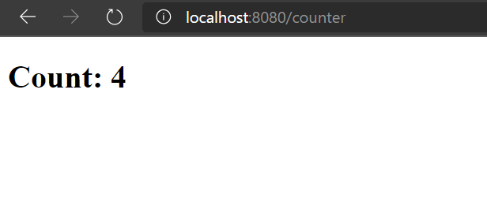

# Quick start

### Setup:

```
npm i @kaleidawave/prism
```

Check its installed

```
prism info
```

```
 ______   ______     __     ______     __    __
/\  == \ /\  == \   /\ \   /\  ___\   /\ "-./  \    Prism Compiler
\ \  _-/ \ \  __<   \ \ \  \ \___  \  \ \ \-./\ \   1.4.4
 \ \_\    \ \_\ \_\  \ \_\  \/\_____\  \ \_\ \ \_\  @kaleidawave
  \/_/     \/_/ /_/   \/_/   \/_____/   \/_/  \/_/
```

> You should see something like this with a version higher or equal to than `1.4.4`

Create a new prism app with `prism init`

Should create:

```
📂 views
	📜 index.prism
📜 prism.config.json
```

We can start it up and run it with `prism compile-app --run open`

And we should see a new browser window showing Hello World.

### Prism syntax:

Open up `views/index.prism`

> For syntax highlighting if using vscode add this to vscode `settings.json` `"files.associations": { "*.prism": "html" }`

You should see:

```html
<template>
    <h1>Hello World</h1>
</template>

<script>
    @Page("/")
    class IndexPage extends Component {}
</script>
```

You can see where the "Hello World" came from. You can also see `@Page` which denotes that this component is a page to be rendered under "/"

#### Adding styles:

Prism is built on single file components. This means that you can append a style tag which contains the styles for the this page / component.

```diff
...
+ <style>
+     h1 {
+         color: red;
+         font-family: sans-serif;
+     }
+ </style>
```

#### Adding a new page:

We can create a new page by creating a new `.prism` file in the `views` directory. We will call it `counter.prism` and we will copy the content of the `index.page`. 

- Set the page to be matched under `/counter` with `@Page("/counter")`. 
- Set the h1 text to be `Count: {}`. The curly braces indicate we want to interpolate the `count` value
- Prism currently requires to know type information of the state. The component we extends needs a generic parameter that is the type def of the state. We can use `extends Component<{count: number}>` to depict that the component state has a property of count of type number. 
- We can add another decorator to depict the default / initial state of the component using `@Default({count: 4})` 

```html
<template>
    <h1>Count: {count}</h1>
</template>

<script>
    @Page("/counter")
    @Default({count: 4})
    class CounterPage extends Component<{count: number}> {}
</script>
```

Save the file, (close the existing server ctrl+c if it is still open). And rebuild and run with `prism compile-app --run`. 

Going to `/counter` we now see our counter with the 4 interpolated into the markup.



Prism outputs web components with a reactive state. We can get the `counter-page` component and update its state in the console:

```js
const counterPageInstance = document.querySelector("counter-page");
counterPageInstance.data.count++;
```

`.data.count` acts like any other object member. You can read its value and mutate it freely while the view will update to its value.

#### Events:

Modifying the state through dev tools is great but lets add some buttons to do this. 

```html
<template>
    <h1>Count: {count}</h1>
    <button @click="increment">Increment count</button>
</template>
...
```

We can add events by adding a new attribute. The attribute key name is `@` in front of the event name and the value is the name of the method on the component definition:

```html
...
<script>
    @Page("/counter")
    @Default({count: 4})
    class CounterPage extends Component<{count: number}> {
        increment() {
            this.data.count++;
        }
    }
</script>
```

#### More coming soon:

- SSR
- Layouts
- Page metadata
- #if, and #for
